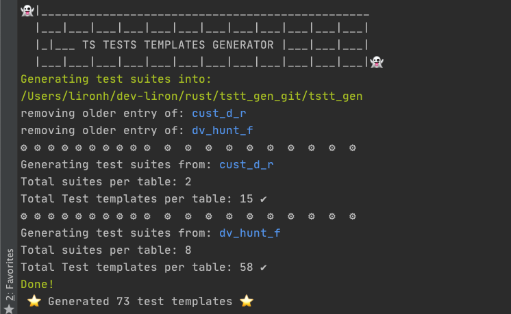

## TSTT_GEN

Super fast TS tests template generator written in Rust.

WIP 

#### Development process 
 
Prepare tests suites as json from sheets: [read more](https://github.com/LironHazan/tstt_gen/tree/master/sheets)

`cd sheets && node sheets_as_json.js`

Parse suites into test files:

`cargo run`

Run all:

` cd sheets && node sheets_as_json.js && cd .. && cargo run `

Blog Posts
- [a-recipe-for-starting-actix-web-server-and-launch-chrome](https://itnext.io/a-recipe-for-starting-actix-web-server-and-launch-chrome-b792987935a)
